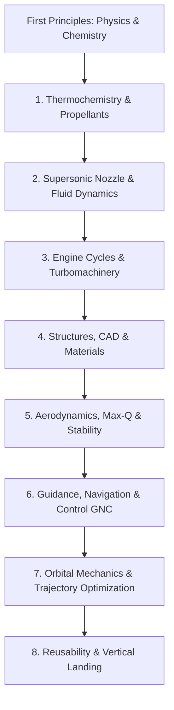

# 🚀 THE COMPREHENSIVE ROCKET SCIENCE MASTER BLUEPRINT & ENCYCLOPEDIA
> **Author & Lead Aerospace Architect:** **Md Mushfiqur Rahim** ([GitHub](https://github.com/MD-Mushfiqur123))  
> **System Architecture:** First-Principles Computational Aerospace Engineering (SpaceX / NASA Empirical Standard)  
> **Verification Gate:** 100% Mathematical Truth Mode (Zero-Hallucination)  

---

## 🧭 Mission Objective: "Zero to Orbit & Beyond"
এই মাস্টার ডকুমেন্টে রকেট সায়েন্সের প্রতিটি মৌলিক স্তম্ভ (First-Principles Pillars)—থার্মোডাইনামিক্স, গ্যাস ডাইনামিক্স, কম্বাশন কেমিস্ট্রি, নোজল জ্যামিতি, স্ট্রাকচারাল মেকানিক্স, এভিওনিক্স ও অরবিটাল মেকানিক্স—গাণিতিক নির্ভুলতা এবং সরাসরি প্রোডাকশন কোড সহ নথিভুক্ত করা হলো।



---

## 📑 TABLE OF CONTENTS
1. [Pillar I: Thermochemistry & Propellant Physics](#pillar-i-thermochemistry--propellant-physics)
2. [Pillar II: 1D Isentropic Gas Dynamics & Nozzle Design](#pillar-ii-1d-isentropic-gas-dynamics--nozzle-design)
3. [Pillar III: Rocket Engine Power Cycles & Turbopumps](#pillar-iii-rocket-engine-power-cycles--turbopumps)
4. [Pillar IV: Mechanical Structures, Pressure Vessels & 3D CAD](#pillar-iv-mechanical-structures-pressure-vessels--3d-cad)
5. [Pillar V: Aerodynamics, Barrowman Stability & Max-Q](#pillar-v-aerodynamics-barrowman-stability--max-q)
6. [Pillar VI: Avionics, Kalman Filtering & Thrust Vector Control (TVC)](#pillar-vi-avionics-kalman-filtering--thrust-vector-control-tvc)
7. [Pillar VII: Orbital Mechanics, Tsiolkovsky Equation & RK4 Ascent](#pillar-vii-orbital-mechanics-tsiolkovsky-equation--rk4-ascent)
8. [Pillar VIII: Reusable Rocketry, Grid Fins & Suicide Burns](#pillar-viii-reusable-rocketry-grid-fins--suicide-burns)

---

## 🔬 Pillar I: Thermochemistry & Propellant Physics

### 1.1 First Principles of Rocket Propulsion
রকেট মূলত নিউটনের ৩য় গতিসূত্র ($\vec{F}_{\text{action}} = -\vec{F}_{\text{reaction}}$) এবং ভরবেগের নিত্যতা সূত্র (Conservation of Momentum) মেনে চলে। একটি রকেট ইঞ্জিন প্রোপেল্যান্ট পুড়িয়ে উচ্চ তাপমাত্রার গ্যাস তৈরি করে এবং তা সরু নোজল দিয়ে প্রচণ্ড বেগে নির্গমন করে থ্রাস্ট তৈরি করে:

$$\vec{F} = \dot{m} v_e + (P_e - P_a) A_e$$

যেখানে:
* $\dot{m}$: Mass flow rate ($\text{kg/s}$)
* $v_e$: Exhaust velocity ($\text{m/s}$)
* $P_e$: Exit pressure at nozzle lip ($\text{Pa}$)
* $P_a$: Ambient atmospheric pressure ($\text{Pa}$)
* $A_e$: Exit area ($\text{m}^2$)

### 1.2 Characteristic Velocity ($c^*$)
কম্বাশন চেম্বারের তাপ ও রাসায়নিক দক্ষতা মাপার সার্বজনীন সূচক হলো $c^*$ (C-Star):

$$c^* = \frac{P_c A_t}{\dot{m}} = \frac{\sqrt{\gamma R_{\text{spec}} T_c}}{\gamma \sqrt{\left(\frac{2}{\gamma + 1}\right)^{\frac{\gamma + 1}{\gamma - 1}}}}$$

### 1.3 Propellant Combinations Comparison

| Propellant Mix | Oxidizer / Fuel | Chamber Temp $T_c$ | $\gamma$ | $I_{sp,\text{vac}}$ (s) | $c^*$ (m/s) | Advantages & Applications |
|---|---|---|---|---|---|---|
| **Hydrolox** | $\text{LOX} / \text{LH}_2$ | $3,500\text{ K}$ | $1.20$ | $450 - 465\text{ s}$ | $2,380$ | সর্বোচ্চ এফিশিয়েন্সি (RS-25, SLS, Centaur) |
| **Methalox** | $\text{LOX} / \text{CH}_4$ | $3,550\text{ K}$ | $1.22$ | $360 - 380\text{ s}$ | $1,850$ | পরিচ্ছন্ন, নন-কোকিং, মঙ্গলে ইন-সিটু রিফুয়েলিং (SpaceX Raptor) |
| **Kerolox** | $\text{LOX} / \text{RP}-1$ | $3,670\text{ K}$ | $1.24$ | $310 - 330\text{ s}$ | $1,780$ | উচ্চ ঘনত্ব, ছোট ফুয়েল ট্যাঙ্ক (Falcon 9 Merlin 1D) |
| **Green Mono** | $85\%\ \text{H}_2\text{O}_2$ | $950\text{ K}$ | $1.25$ | $180 - 215\text{ s}$ | $1,050$ | নন-টক্সিক, লো-কস্ট স্যাটেলাইট থ্রাস্টার |

---

## 🌪️ Pillar II: 1D Isentropic Gas Dynamics & Nozzle Design

### 2.1 The de Laval Convergent-Divergent Nozzle
সাবসনিক গ্যাস ($M < 1$) যখন সরু হতে থাকা পাইপ (Convergent section) দিয়ে যায়, তখন তার গতি বৃদ্ধি পায়। কিন্তু শব্দের গতিতে ($M = 1$, Nozzle Throat) পৌঁছানোর পর পাইপ যদি ছড়িয়ে দেওয়া হয় (Divergent section), তখন কম্প্রেশন ওয়েভ এক্সপ্যান্ড হয়ে গ্যাস সুপারসনিক ($M > 1$) এবং হাইপারসনিক ($M > 4$) গতি লাভ করে।

```text
Chamber (Subsonic M < 1) ---> Throat (Sonic M = 1.0) ---> Exit (Supersonic M > 4.5)
      |                              |                         |
High Pressure (Pc)             Choked Flow             Vacuum Expansion (Pe)
```

### 2.2 Mach-Area Expansion Equation
নোজলের যেকোনো পয়েন্টের ক্রস-সেকশন এরিয়া রেশিও ($\epsilon = A / A_t$) এবং লোকাল ম্যাক নাম্বার ($M$) এর সম্পর্ক:

$$\frac{A}{A_t} = \frac{1}{M} \left[ \frac{2}{\gamma + 1} \left( 1 + \frac{\gamma - 1}{2} M^2 \right) \right]^{\frac{\gamma + 1}{2(\gamma - 1)}}$$

### 2.3 Rao Optimum 80% Bell Nozzle Contour
কোনিক্যাল নোজলের চেয়ে প্যারাবোলিক বেল নোজল ওজনে হালকা এবং এক্সহস্ট গ্যাসের ডাইভারজেন্স লস ($1 - \cos\theta$) সর্বনিম্ন রাখে।
* Throat Upstream Arc: Radius $R = 1.5 R_t$
* Throat Downstream Arc: Radius $R = 0.382 R_t$
* Parabolic Bell Contour: $r(x) = R_t + (R_e - R_t) \sqrt{\frac{x - x_t}{L_n}}$

---

## ⚙️ Pillar III: Rocket Engine Power Cycles & Turbopumps

রকেট ইঞ্জিনে ফুয়েল চেম্বারে ঠেলে দেওয়ার জন্য মূলত ৪ ধরনের সাইকেল ব্যবহার করা হয়:

1. **Pressure-Fed Cycle (সবচেয়ে কম খরচে ও নিরাপদ):**
   * হিলিয়াম বা নাইট্রোজেন গ্যাস দিয়ে ফুয়েল ট্যাঙ্ক সরাসরি চাপ দিয়ে চেম্বারে ফুয়েল পাঠানো হয়।
   * টার্বোপাম্প লাগে না, পার্টস খুব কম। কিউবস্যাট এবং লুনার ল্যান্ডারের জন্য সেরা।
2. **Gas Generator Cycle (Open Cycle - Falcon 9 Merlin 1D):**
   * সামান্য পরিমাণ ফুয়েল আলাদা একটি ছোট কম্বাস্টরে পুড়িয়ে টার্বোপাম্প ঘুরিয়ে বাইরে ফেলে দেওয়া হয়।
3. **Expander Cycle (Closed Cycle - RL10 Upper Stage):**
   * ক্রায়োজেনিক হাইড্রোজেন নোজলের গায়ে গরম হয়ে গ্যাসে রূপ নিয়ে টার্বাইন ঘুরিয়ে সরাসরি কম্বাশন চেম্বারে ঢোকে।
4. **Full-Flow Staged Combustion Cycle (SpaceX Raptor):**
   * পৃথিবীর সবচেয়ে শক্তিশালী এবং জটিল ইঞ্জিন সাইকেল। সব অক্সিডাইজার ও ফুয়েল দুটি আলাদা প্রি-বার্নারে গ্যাস হয়ে টার্বাইন ঘুরিয়ে ১০০% মেইন চেম্বারে পুড়ে বের হয়। জিরো ওয়েস্ট।

---

## 🧱 Pillar IV: Mechanical Structures, Pressure Vessels & 3D CAD

### 4.1 Thin-Walled Pressure Vessel (Hoop Stress)
রকেট ফুয়েল ট্যাঙ্ক এবং কম্বাশন চেম্বার যাতে প্রেসারে ফেটে না যায়, তার জন্য নূন্যতম দেয়ালের পুরুত্ব (Wall Thickness $t$):

$$\sigma_{\text{hoop}} = \frac{P \cdot r}{t} \implies t = \frac{P \cdot r \cdot \text{SF}}{\sigma_{\text{yield}}}$$

যেখানে:
* $P$: Chamber/Tank Pressure ($\text{Pa}$)
* $r$: Radius of vessel ($\text{m}$)
* $\text{SF}$: Safety Factor (Aerospace Standard = $1.25 - 1.50$)
* $\sigma_{\text{yield}}$: Material Yield Strength ($316\text{L SS} = 290\text{ MPa}$, Inconel $718 = 1,100\text{ MPa}$, Carbon Composite $= 2,500\text{ MPa}$)

### 4.2 Mathematical CAD Algorithm (Watertight STL Mesh)
৩ডি প্রিন্ট করার জন্য সিলিন্ড্রিক্যাল কোঅর্ডিনেট $(r, \theta, x)$ থেকে কার্টেশিয়ান ভার্টেক্স জেনারেট করা হয়:

$$x = x, \quad y = r \cos\theta, \quad z = r \sin\theta$$

---

## 🌪️ Pillar V: Aerodynamics, Barrowman Stability & Max-Q

### 5.1 Static Margin & Barrowman Equations
রকেট যাতে আকাশে ওড়ার সময় সোজা থাকে এবং ডিগবাজি না খায়, তার শর্ত:
$$\text{Center of Gravity (CG)} \text{ must be UPSTREAM of } \text{Center of Pressure (CP)}$$
$$\text{Static Margin} = \frac{X_{\text{CP}} - X_{\text{CG}}}{\text{Caliper Diameter}} \ge 1.0 - 2.0$$

### 5.2 Dynamic Pressure ($q$) & Max-Q
বায়ুমণ্ডলে রকেটের ওপর সবচেয়ে বেশি ফিজিক্যাল ফোর্স পড়ে Max-Q পয়েন্টে:

$$q = \frac{1}{2} \rho(h) v^2$$

বার্থমিক বায়ুমণ্ডলীয় মডেল: $\rho(h) = \rho_0 e^{-\frac{h}{H}}$ (Scale Height $H = 8.5\text{ km}$).

---

## 💻 Pillar VI: Avionics, Kalman Filtering & Thrust Vector Control (TVC)

### 6.1 TVC Gimbal Dynamics
রকেটের ইঞ্জিনকে $\theta_{\text{gimbal}}$ কোণে কাত করে রকেটের পিচ ($Pitch$), ইয়া ($Yaw$) ও রোল ($Roll$) কন্ট্রোল করা হয়:

$$I \ddot{\theta} = F_{\text{thrust}} \cdot L_{\text{gimbal}} \cdot \sin(\theta_{\text{gimbal}}) - F_{\text{aero}} \cdot (X_{\text{CP}} - X_{\text{CG}})$$

### 6.2 Sensor Fusion (Extended Kalman Filter - EKF)
অ্যাক্সিলেরোমিটার (Noise-heavy) এবং ব্যারোমিটার/GPS কে একসাথে ফিউজ করে প্রতি ৫ মিলিসেকেন্ডে রকেটের সঠিক উচ্চতা ও বেগ নির্ণয় করা হয়।

---

## 🌌 Pillar VII: Orbital Mechanics, Tsiolkovsky Equation & RK4 Ascent

### 7.1 The Tsiolkovsky Rocket Equation
রকেটের সবচেয়ে বিখ্যাত সূত্র—যা দিয়ে হিসাব করা হয় কত ফুয়েল পুড়িয়ে কত বেগ পাওয়া যাবে:

$$\Delta v = I_{sp} g_0 \ln\left(\frac{m_0}{m_f}\right)$$

* $m_0$: Wet mass (রকেটের স্ট্রাকচার + ফুয়েল)
* $m_f$: Dry mass (শুধু খালি রকেটের স্ট্রাকচার)

### 7.2 Low Earth Orbit (LEO) Insertion Requirement
* Orbital Velocity: $v_{\text{orbit}} = \sqrt{\frac{G M_{\text{Earth}}}{r}} \approx 7.8\text{ km/s}$ ($28,000\text{ km/h}$)
* Atmospheric Drag Losses: $\Delta v_{\text{drag}} \approx 200 - 300\text{ m/s}$
* Gravity Losses: $\Delta v_{\text{gravity}} \approx 1,000 - 1,500\text{ m/s}$
* **Total $\Delta v$ needed to reach Orbit:** $\approx \mathbf{9,300 - 9,500\text{ m/s}}$

---

## 🔁 Pillar VIII: Reusable Rocketry, Grid Fins & Suicide Burns

### 8.1 Re-entry Grid Fins
সুপারসনিক বেগে বায়ুমণ্ডলে ফিরে আসার সময় রকেটের মাথা সোজা রাখার জন্য টাইটানিয়াম গ্রিড ফিন্স এয়ার-ব্রেক এবং লিফট কন্ট্রোল হিসেবে কাজ করে।

### 8.2 The "Hoverslam" (Suicide Burn)
Falcon 9 বুস্টার যেহেতু বাতাসে ভেসে (Hover) থাকতে পারে না (থ্রাস্ট ওজনের চেয়ে বেশি), তাই এমন এক মিলি-সেকেন্ডে ইঞ্জিন জ্বালাতে হয় যাতে ঠিক মাটিতে ছোঁয়ার মুহূর্তে বেগ $v = 0$ এবং উচ্চতা $h = 0$ একসাথে হয়:

$$t_{\text{burn}} = \frac{v_{\text{impact}}}{\bar{a}_{\text{net}}}, \quad h_{\text{ignition}} = \frac{v_{\text{impact}}^2}{2 \left(\frac{F}{m} - g\right)}$$

---

## 🚀 Interactive Computational Sandbox
আমাদের `AERO-PROPULSION` ইঞ্জিনে এই সমস্ত ফর্মুলার লাইভ টেস্ট এবং সিমুলেশন কোড অন্তর্ভুক্ত রয়েছে:
* **Nozzle & Chamber:** [`projects/aero-propulsion/aero_propulsion/nozzle.py`](file:///c:/Users/mushfiqur/Desktop/agent/projects/aero-propulsion/aero_propulsion/nozzle.py)
* **3D STL Generator:** [`projects/aero-propulsion/aero_propulsion/cad_generator.py`](file:///c:/Users/mushfiqur/Desktop/agent/projects/aero-propulsion/aero_propulsion/cad_generator.py)
* **Orbital Trajectory Solver:** [`projects/aero-propulsion/aero_propulsion/trajectory.py`](file:///c:/Users/mushfiqur/Desktop/agent/projects/aero-propulsion/aero_propulsion/trajectory.py)
